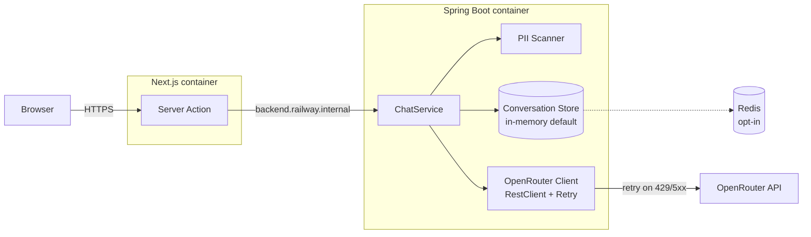

# Nordic Dev Mentor

A Spring Boot middleware that proxies chat requests to OpenRouter with four
distinct mentor personalities, paired with a Next.js frontend in editorial
Nordic design.

**Live demo:** https://frontend-production-25e3.up.railway.app/

## What it does

Each mentor has its own system prompt and sampling temperature, giving them
distinct voices:

| Mentor | Role |
|---|---|
| `junior-helper` | Patient mentor for beginners — explains from first principles |
| `senior-architect` | "It depends" — focuses on trade-offs and judgment calls |
| `code-reviewer` | Strict and direct, no sugarcoating |
| `rubber-duck` | Asks Socratic questions instead of answering, with a programming joke at the end |

Conversations persist via localStorage. The History page lets you reopen
prior sessions or delete them. Personality can be switched mid-conversation
without losing context.

## Tech stack

**Backend**
- Spring Boot 4 on Java 21
- Spring RestClient (sync) over JDK 11 HttpClient against OpenRouter
- Spring Retry `RetryTemplate` (429 / 5xx with exponential backoff + Idempotency-Key for dedup)
- springdoc-openapi at `/swagger-ui.html`
- Regex-based PII filter (email, Swedish personnummer with Luhn, Swedish phone) — masks input before forwarding to OpenRouter
- Pluggable conversation store with sliding-window history (in-memory by default, Redis opt-in)
- Spring Boot Actuator for `/actuator/health`

**Frontend**
- Next.js 16 (App Router) with Server Actions
- React 19, TypeScript, Tailwind CSS 4
- `next/font` self-hosting Crimson Pro / Inter / JetBrains Mono
- `react-markdown` for assistant replies
- Editorial Nordic design — single light theme

**Infrastructure**
- Railway monorepo deployment, two services
- Backend reachable only via internal DNS (`backend.railway.internal`)
- Frontend Server Actions bridge browser to backend — API key never leaves
  the backend, no CORS configuration needed

**Tests**
- 55 backend tests (JUnit 5 + WireMock + MockMvc + Mockito)
- 26 frontend tests (Vitest + React Testing Library)

## Architecture

Runtime topology — two Railway services, with the OpenRouter API key isolated
to the backend and PII masked before any request leaves the JVM:



Hexagonal layout — domain layer has no Spring imports:

```
src/main/java/se/devmentor/
├── web/             — REST controller, exception handler, DTOs
├── application/     — ChatService orchestrates the chat flow
├── domain/          — Personality, Message, LlmClient port, ConversationStore port
├── infrastructure/  — OpenRouter adapter, in-memory store
└── config/          — @ConfigurationProperties beans, OpenAPI config
```

The frontend mirrors the idea: Server Actions are the only path from UI to
backend. Browser code never knows the backend URL or sees the API key — all
of that happens server-side inside the Next.js container.

## Architectural decisions

Significant design choices are recorded as ADRs under [`documentation/adr/`](documentation/adr/):

- [ADR-0001: Retry mechanism for OpenRouter integration](documentation/adr/0001-retry-mechanism.md)
  — programmatic `RetryTemplate` chosen over `@Retryable`, with a worked-out
  alternative implementation (two-bean pattern, AOP proxy pitfall, idempotency
  trade-off) documented for future reference.

## Local development

### Backend

1. Sign up at [openrouter.ai](https://openrouter.ai) and generate an API key.
   Top up $5 of credits (Claude 3.5 Haiku is the default; free models also
   work via the `OPENROUTER_MODEL` env var).

2. Create `.env`:

   ```bash
   cp .env.example .env
   # edit .env, fill in OPENROUTER_API_KEY
   ```

3. Run:

   ```bash
   JAVA_HOME=$(/usr/libexec/java_home -v 21) mvn spring-boot:run
   ```

4. Verify:
   - Swagger UI: http://localhost:8080/swagger-ui.html
   - Health: http://localhost:8080/actuator/health

### Frontend

In a separate terminal:

```bash
cd frontend
cp .env.example .env.local
npm install
npm run dev
```

Open http://localhost:3000.                                                                                                                                     
                                                                                                                                                                  
  ### Tests                                                                                                                                                       
                                                                                                                                                                  
  ```bash                                     
  mvn test                   # backend (55 tests)
  mvn verify                 # backend + coverage report
  cd frontend && npm test    # frontend (26 tests)                                                                                                                
  ```
                                                                                                                                                                  
  Coverage report at `target/site/jacoco/index.html`.
                                          
  ## Conversation store options
                                                                                                                                                                  
  The backend has two `ConversationStore` implementations behind the same port,
  selected at startup via the `DEVMENTOR_STORE_TYPE` env var.                                                                                                     
                                              
  ### In-memory (default)                 

  No setup. Conversations live in a `ConcurrentHashMap` in app memory. Lost on                                                                                    
  restart, doesn't scale across instances. Fine for local dev and demos.
                                                                                                                                                                  
  ### Redis (opt-in)                      

  Persists conversations in Redis. Survives restarts and works across instances.                                                                                  
   
  1. Set env vars in `.env`:                                                                                                                                      
                                          
     ```bash
     DEVMENTOR_STORE_TYPE=redis                                                                                                                                   
     MANAGEMENT_HEALTH_REDIS_ENABLED=true
     ```                                                                                                                                                          
                                          
  2. Run the backend:
                                                                                                                                                                  
     ```bash
     JAVA_HOME=$(/usr/libexec/java_home -v 21) mvn spring-boot:run                                                                                                
     ```          

     The `spring-boot-docker-compose` integration auto-starts `compose.yaml`
     (Redis 7-alpine on `localhost:6379`) and connects the app once the
     container is healthy. Stopping the app stops the container too.
                                                                                                                                                                  
  3. Inspect data while the app runs:     
                                                                                                                                                                  
     ```bash                                                                                                                                                      
     docker exec -it nordic-dev-mentor-redis redis-cli
     > KEYS ndm:session:*                                                                                                                                         
     > LRANGE ndm:session:<id> 0 -1           
     ```                                  

  The Redis adapter stores one Redis List per session under the key                                                                                               
  `ndm:session:<sessionId>` and enforces the sliding window via `RPUSH` +
  `LTRIM`. Window size comes from `devmentor.conversation.max-messages`.                                                                                          
                                          
  For production (Railway etc.), point `REDIS_HOST`, `REDIS_PORT`, and
  `REDIS_PASSWORD` at your hosted Redis. Docker Compose is a local-dev                                                                                            
  convenience only.


## PII filtering

### Why

The middleware forwards user input to OpenRouter, a third-party LLM provider
outside the EU. To reduce exfiltration risk we mask common Swedish PII
patterns from the user message before the request leaves the backend. This
is a defense-in-depth measure, not a substitute for a formal compliance
review.

### What gets masked

| Type | Detection | Mask token |
|---|---|---|
| Email | Standard pattern with word boundaries | `[EMAIL]` |
| Personnummer | `YYMMDD-XXXX` or `YYYYMMDD-XXXX` (separator required) + Luhn checksum | `[PERSONNUMMER]` |
| Phone | Swedish mobile and landline (`+46` / `0[1-9]` anchored) | `[PHONE]` |

The set of types actually detected in a request is returned in
`maskedFields` on the response, so clients can surface this to the user.

### How to configure

In `application.yml`:

```yaml
devmentor:
  pii:
    enabled: true
    types:
      email: true
      phone: true
      personnummer: true
```

`enabled: false` skips the scanner entirely and `maskedFields` is always
empty. Per-type flags allow selectively disabling detection without
redeploying code.

### What is NOT detected

- Names, postal addresses, IP addresses (would need NER, out of scope)
- Personnummer without a separator (would conflict with phone-like patterns)
- Non-Swedish phone formats
- PII in the LLM's reply — only input is scanned


## API

`POST /api/v1/chat`

```json
{
  "personality": "senior-architect",
  "message": "Should I use Postgres or MongoDB?",
  "sessionId": "optional-uuid-to-continue-conversation"
}
```

Returns `{ sessionId, personality, reply }`.

`DELETE /api/v1/chat/{sessionId}` — clears the in-memory history for a session.

Full schema at `/swagger-ui.html`.

## Known limitations

- **In-memory backend store (default)** — conversations vanish on backend
  restart. The frontend's localStorage keeps session IDs visible in History,
  but the server side has nothing to rehydrate from. Opt in to Redis mode
  (see "Conversation store options") to keep state across restarts.
- **No authentication** — a session ID is an opaque UUID. Anyone who guesses
  one can read that conversation. A real product would bind sessions to JWT.
- **Single instance only** — sliding-window history is per-process, so
  horizontal scaling would need external session storage.
- **PII filter is regex-based and Sweden-focused** — see PII filtering
  section. Don't rely on it as a sole compliance control.
- **No streaming** — backend returns the full LLM reply in one response. The
  frontend shows a typing indicator during the await.
